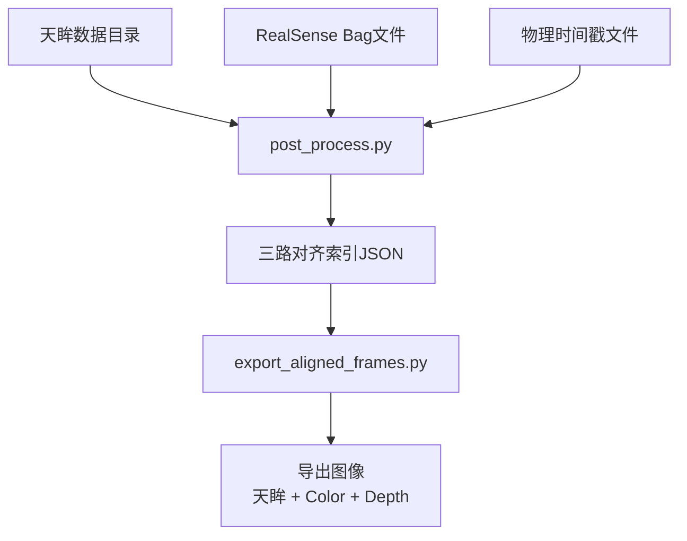

# 三路对齐后处理使用文档

## 概述

`post_process.py` 实现天眸、RealSense Depth、RealSense Color 三路数据的帧级对齐，输出对齐索引文件，供下游 `export_aligned_frames.py` 导出图像使用。

## 工作流程



## 1. post_process.py - 三路对齐

### 功能

1. 读取物理基准时间戳（外部电路触发时间）
2. 读取天眸帧时间戳
3. 找到锚定点（天眸帧 ≈ 物理时间戳）
4. Depth 与天眸对齐（基于帧间隔检测跳帧）
5. Color 与 Depth 对齐（基于 Frame Counter + 相位偏移）
6. 输出三路对齐的 JSON 索引文件

### 使用方法

```bash
conda activate tianmoucv

python3 yyf/post_process.py \
  --tianmou-dir /projects/cxr_data/20260323_1754 \
  --bag /projects/cxr_data/2026-3-23/17-54-25.bag \
  --temporal /projects/cxr_data/temporal_files/tianmou_timestamp_20260323_175504.csv \
  -o output_triple_aligned.json
```

### 参数说明

| 参数 | 说明 | 示例 |
|------|------|------|
| `--tianmou-dir` | 天眸数据目录 | `/projects/cxr_data/20260323_1754` |
| `--bag` | RealSense bag文件 | `/projects/cxr_data/2026-3-23/17-54-25.bag` |
| `--temporal` | 物理基准时间戳CSV文件 | `/projects/cxr_data/temporal_files/tianmou_timestamp_20260323_175504.csv` |
| `-o, --output` | 输出JSON文件 | `output_triple_aligned.json` |
| `--auto` | 自动匹配文件（基于temporal文件名推断） | |

### 输出格式

```json
{
  "input": {
    "tianmou_dir": "/projects/cxr_data/20260323_1754",
    "bag_path": "/projects/cxr_data/2026-3-23/17-54-25.bag",
    "temporal_file": "...",
    "timestamp_source": "TianmoucDataReader (C_timestamp[0] * 10)"
  },
  "anchor": {
    "tianmou_frame_index": 62,
    "depth_frame_index": 0,
    "physical_timestamp_us": 1774259671557100
  },
  "statistics": {
    "total_tianmou_frames": 989,
    "total_depth_frames": 871,
    "total_color_frames": 3446,
    "common_frame_counters": 3335,
    "valid_triple_aligned": 799,
    "invalid_no_color": 72
  },
  "frames": [
    {
      "depth_idx": 8,
      "depth_counter": 8,
      "tianmou_idx": 70,
      "dt_ms": 33.002,
      "skip_count": 0,
      "is_valid": true,
      "has_color": true,
      "color_counter": 0
    }
  ]
}
```

### 字段说明

| 字段 | 说明 |
|------|------|
| `depth_idx` | 对齐后的 Depth 帧索引（从0开始） |
| `depth_counter` | Depth 的 Frame Counter（用于匹配图像） |
| `tianmou_idx` | 对应的天眸帧索引 |
| `dt_ms` | 与上一帧的时间间隔（ms） |
| `skip_count` | 跳过的天眸帧数 |
| `is_valid` | 是否有效（与 Color 对齐后决定） |
| `has_color` | 是否有对应的 Color 帧 |
| `color_counter` | Color 的 Frame Counter（用于匹配图像） |

## 2. export_aligned_frames.py - 导出图像

### 功能

1. 根据索引文件读取三路对齐的帧
2. 导出天眸 RGB 图像
3. 导出 RealSense Color 图像
4. 导出 RealSense Depth 图像
5. 生成三路对比图像

### 使用方法

```bash
conda activate tianmoucv

python3 yyf/export_aligned_frames.py \
  -i output_triple_aligned.json \
  -t /projects/cxr_data/20260323_1754 \
  -b /projects/cxr_data/2026-3-23/17-54-25.bag \
  -o ./export_output \
  -m 100
```

### 参数说明

| 参数 | 说明 | 示例 |
|------|------|------|
| `-i, --index` | 对齐索引JSON文件 | `output_triple_aligned.json` |
| `-t, --tianmou-dir` | 天眸数据目录 | `/projects/cxr_data/20260323_1754` |
| `-b, --bag` | RealSense bag文件 | `/projects/cxr_data/2026-3-23/17-54-25.bag` |
| `-o, --output` | 输出目录 | `./export_output` |
| `-m, --max-frames` | 最大导出帧数（-1表示全部） | `100` |

### 输出目录结构

```
export_output/
├── tianmou/           # 天眸图像
│   ├── tianmou_0000.png
│   ├── tianmou_0001.png
│   └── ...
├── color/             # RealSense Color 图像
│   ├── color_0000.png
│   ├── color_0001.png
│   └── ...
├── depth/             # RealSense Depth 图像
│   ├── depth_0000.png
│   ├── depth_0001.png
│   └── ...
├── comparison/        # 三路对比图像
│   ├── compare_0000.png
│   ├── compare_0001.png
│   └── ...
└── realsense_raw/     # 原始提取的图像
    ├── color/
    └── depth/
```

### 对比图像说明

对比图像为 **天眸 | Color | Depth** 三路水平拼接，并附有信息栏：

```
┌─────────────────┬─────────────────┬─────────────────┐
│                 │                 │                 │
│     天眸        │     Color       │     Depth       │
│                 │                 │                 │
├─────────────────┴─────────────────┴─────────────────┤
│  Depth#8 | Counter: D=8, C=0 | dt=33.0ms         │
│  Tianmou#70 | Time: 17:54:31.xxx | Skip: 0        │
└───────────────────────────────────────────────────┘
```

## 3. 完整使用示例

### 3.1 数据准备

假设有以下数据：

- 天眸目录：`/projects/cxr_data/20260323_1754`
- Bag文件：`/projects/cxr_data/2026-3-23/17-54-25.bag`
- 时间戳文件：`/projects/cxr_data/temporal_files/tianmou_timestamp_20260323_175504.csv`

### 3.2 执行对齐

```bash
cd /home/nvidia/Desktop/cxr_multi_sensor

conda activate tianmoucv

# 执行三路对齐
python3 yyf/post_process.py \
  --tianmou-dir /projects/cxr_data/20260323_1754 \
  --bag /projects/cxr_data/2026-3-23/17-54-25.bag \
  --temporal /projects/cxr_data/temporal_files/tianmou_timestamp_20260323_175504.csv \
  -o output_triple_aligned.json

# 查看统计信息
echo "对齐完成，查看统计："
python3 -c "import json; d=json.load(open('output_triple_aligned.json')); print(f'有效三路对齐帧: {d[\"statistics\"][\"valid_triple_aligned\"]}')"
```

### 3.3 导出图像

```bash
# 导出前100帧用于检查
python3 yyf/export_aligned_frames.py \
  -i output_triple_aligned.json \
  -t /projects/cxr_data/20260323_1754 \
  -b /projects/cxr_data/2026-3-23/17-54-25.bag \
  -o ./export_preview \
  -m 100

# 或导出全部帧
python3 yyf/export_aligned_frames.py \
  -i output_triple_aligned.json \
  -t /projects/cxr_data/20260323_1754 \
  -b /projects/cxr_data/2026-3-23/17-54-25.bag \
  -o ./export_full
```

### 3.4 查看结果

```bash
# 查看对比图像
ls -la export_preview/comparison/

# 或用图像查看器打开
eog export_preview/comparison/compare_0000.png
```

## 4. 对齐原理

### 4.1 Depth 与天眸对齐

基于帧间隔检测跳帧：

- `dt ≈ 33ms`：正常帧，天眸+1，Depth+1
- `dt ≈ 66ms`：跳帧，天眸+2，Depth+1
- `dt ≈ 99ms`：跳帧，天眸+3，Depth+1
- `dt ≈ 0ms`：重复帧，天眸不变，Depth+1

### 4.2 Color 与 Depth 对齐

基于 Frame Counter 和相位偏移：

1. 找共有 Frame Counter 的帧
2. 计算 `Diff = |Color_Timestamp - Depth_Timestamp| / 1000`（ms）
3. 计算 `相位偏移 = round(Diff / 33)`
4. 根据偏移建立 Color → Depth 的映射
5. 丢弃没有 Color 匹配的 Depth 帧

## 5. 常见问题

### 5.1 rs-convert 文件累积

`post_process.py` 会在每次运行时自动清空 `/projects/cxr_data/metadata_temp` 目录，确保只处理当前 bag 文件的数据。

### 5.2 天眸帧读取慢

天眸帧读取需要逐帧访问原始数据，989帧大约需要6分钟。已优化进度显示。

### 5.3 有效帧数少

如果 `valid_triple_aligned` 很少，可能原因：

- Color 和 Depth 的 Frame Counter 重叠率低
- 相位偏移不稳定
- 检查 RealSense 硬件同步配置

### 5.4 导出时找不到图像

确保 `export_aligned_frames.py` 能访问到 bag 文件路径，且 rs-convert 成功提取了图像。

## 6. 相关文件

| 文件 | 说明 |
|------|------|
| `yyf/post_process.py` | 三路对齐主脚本 |
| `yyf/export_aligned_frames.py` | 导出对齐帧脚本 |
| `yyf/check_bag_metadata.py` | 检查 Bag metadata 脚本 |
| `yyf/后处理.md` | 后处理详细设计文档 |
